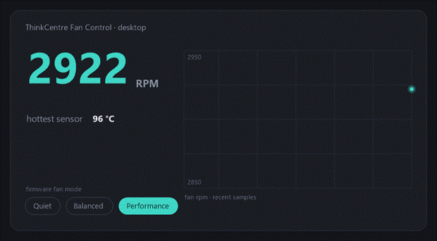
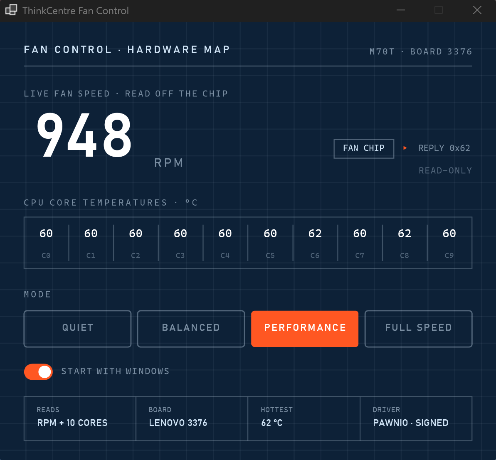

<div align="center">

# 🌀 ThinkCentre Fan Control

**Every tool on your Lenovo ThinkCentre desktop swears the fan runs at `0` RPM.**
### It's spinning, obviously. This one actually reads how fast. It also shows you every core's temperature and hands you the fan modes, right up to a full blast nothing else will.

[](LICENSE)
[](#install)
[](#build-from-source)
[](../../releases/latest)

A small Windows app for Lenovo **ThinkCentre and ThinkStation desktops**. It parks the
**real fan RPM** in your tray, pulled straight off the embedded controller, and opens a window with
**per-core CPU temperatures** and the fan modes, including a **Full Speed** setting Vantage won't
let you near.



</div>

---

## Why it exists

Ask anything what your ThinkCentre's fan is up to. Task Manager, HWiNFO, LibreHardwareMonitor,
Lenovo's own Vantage. Every one of them lies to your face:

> **`0` RPM.**

You can hear it spinning. What Windows gets handed is a fake, stubbed-out controller with
everything zeroed, and that zero is what every tool parrots. The real sensor sits on a different
chip that answers on its own ports, minding its own business. So I read that chip directly and put
the number in your tray.

## What you get

- 🌀 &nbsp;**Live fan RPM.** The number nothing else will give you, in the tray and the window, straight off the EC's tach register once a second.
- 🌡️ &nbsp;**Per-core CPU temperatures.** Every core, read from the CPU's own thermal sensors and drawn as a live graph in the window. The hottest core is called out in both the window and the tray, so a glance tells you how hot it's running.
- 🎛️ &nbsp;**Fan modes, Full Speed and all.** Quiet, Balanced, and Performance flip instantly through the firmware, the exact path Vantage uses. **Full Speed** trips a BIOS setting for real maximum airflow, the loud one Vantage hides from you, and it kicks in on the next restart.
- 🪟 &nbsp;**A window, or just the tray.** Double-click for the whole readout, or leave it tucked away and hover for the RPM. Whatever you're into.
- 🪶 &nbsp;**Barely there.** No telemetry, no account, basically no idle CPU, around 15 MB sitting in the tray. MIT licensed. And it never pokes the chip with a raw write, mode changes ride the vendor's own supported interface.

## What it can't do

> **You can't set the fan to an exact RPM and pin it there, like 1,400 and done.**
>
> That knob lives inside an ACPI method the firmware only bothers loading at runtime, and there's
> no register to reach it from outside. I write-tested the EC myself, it's just not in there, so
> that idea's dead.
>
> Everything else? Real, and run on actual hardware: live RPM, per-core temps, the firmware
> presets, and **Full Speed**, a genuine maximum that happens to be writable from Windows even
> though Vantage flat out refuses to expose it (it's a BIOS value, so it wants a restart). The whole
> story is down in [How it works](#how-it-works).

## Install

**You'll need** Windows 10 or 11, **Administrator**, and ideally a **ThinkCentre M70t Gen 6** (the
board I actually verified; [others below](#supported-hardware)).

**1. Install the PawnIO driver.**
Reading the EC needs a ring-0 driver, so the app leans on [PawnIO](https://pawnio.eu/), a small
code-signed one. Same driver [FanControl](https://github.com/Rem0o/FanControl.Releases) and
LibreHardwareMonitor use, and no, it's not the antivirus-flagged WinRing0. Grab it from
[pawnio.eu](https://pawnio.eu/), run it, hit accept on the UAC prompt.

**2. Download the app.**
Grab the latest [release ZIP](../../releases/latest) and unzip it wherever. The signed
`LpcACPIEC.bin` EC module is already inside, so there's nothing else to chase down. Just keep the
files together, pull the exe out on its own and it won't find the module.

**3. Run it.**
Right-click `Tcfc.Tray.exe`, **Run as administrator** (a plain double-click is fine too, it asks
for elevation on its own). A little fan icon shows up in your tray, probably hiding under the `^`
arrow.

> 💡 &nbsp;**First run:** the exe isn't code-signed, so SmartScreen might throw a "Windows protected
> your PC" at you. Click **More info**, then **Run anyway**. It's open source, so read it or
> [build it yourself](#build-from-source).

## Use it



- **Hover** the tray icon and the tooltip gives you the live RPM.
- **Double-click** it for the window: the big RPM, the per-core graph, the four fan modes, a Start-with-Windows toggle. Closing the window just drops it back to the tray, it doesn't quit.
- **Right-click** for the quick menu:
  - A header line, `RPM <n>  |  hottest core <n> °C`, refreshed when you open it.
  - **Fan mode** (Quiet, Balanced, Performance). Click one to switch, a check marks the current one.
  - **Start with Windows**, which sets up an elevated logon task so you're not clicking UAC every boot.
  - **Exit.**

Quiet, Balanced, and Performance are the firmware's own profiles. Quiet keeps the fan chill.
Performance lets it wind up sooner. Either way the firmware's still running the curve under the
hood. **Full Speed** is the weird one: it pins the fan flat out through a BIOS setting, so it wants
a restart to switch on, and another to switch back off.

## Supported hardware

I've only actually verified a **ThinkCentre M70t Gen 6** (baseboard `3376`).

| Board | Fan RPM + EC temps | Fan modes + Full Speed |
|---|---|---|
| **ThinkCentre M70t Gen 6** (`3376`) | ✅ Correct | ✅ Enabled |
| Other ThinkCentre / ThinkStation desktops | ⚠️ Falls back to the M70t layout, so readings **might be wrong** | 🔒 Off (it won't write to a board I haven't checked) |

Per-core CPU temps come straight from the processor, so those are right on any Intel machine no
matter the board.

Got a different one, an M70q, M710q, M720q, M920q, a bigger ThinkStation, whatever? The EC register layout has to be mapped board by board.
[Open an issue](../../issues) with your model and baseboard product and I'll dig into it.

## How it works

ACPI and WMI are a dead end here. The embedded controller Windows sees is a stub: `_STA` returns
zero, every field reads zero, and the fan telemetry runs through firmware tables that usually
aren't even loaded. That zero is exactly what everything else reports.

But there's a second EC, a real one, answering on ports `0x62` and `0x66` right behind the stub. I
read its RAM through the signed [PawnIO](https://pawnio.eu/) driver and diffed it while pushing the
fan up and down under load. The tach popped right out: a 16-bit big-endian value at `0x00:0x01`,
confirmed against a full spin-up and spin-down. Temperatures sit from `0x21` to `0x2F`.

Per-core CPU temps don't touch the EC at all. Each core's `IA32_THERM_STATUS` MSR, read through the
same PawnIO driver, minus the offset from Tjmax. That's why they're labelled per core and not
guessed at.

The presets were the easy part: a Lenovo WMI method (`SetSmartFanMode`) the firmware actually
honours, verified on the board. **Full Speed** I did not see coming. Lenovo's BIOS has an
"Intelligent Cooling" setting with a "Full speed" option, and it's writable from Windows through
Lenovo's own BIOS WMI, even though Vantage never lets you near it. So the app can pin the fan flat
out and you never open the BIOS. It's a firmware setting though, so it only takes hold after a
restart.

The exact-RPM slider is the one thing I couldn't ship. The write path is an ACPI method (`_FSL`
calling `FNSL`) buried in a table that only exists at runtime, and getting to it means a signed
kernel driver plus killing off Intel's thermal service. Not worth gambling the hardware on. Full
write-up, dead ends and all:

<details>
<summary><b>📖 The full reverse-engineering write-up</b></summary>

- [Design spec and decisions](docs/specs/2026-07-08-thinkcentre-fan-control-design.md): architecture, safety gates, the pivot.
- [EC decode](docs/research/ec-decode-m70t.md): the stubbed ACPI EC, the physical one behind it, the tach hunt, the write-test that killed the slider.
- [Temperature labelling](docs/research/temp-labeling.md): the EC's temperature sensors and why their mapping stays unverified.
- [On-hardware verification](docs/research/v1-cli-verify.md): RPM 932 idle, about 2,800 under load, matching the probe data.

</details>

## Build from source

You'll need the [.NET 8 SDK](https://dotnet.microsoft.com/download/dotnet/8.0).

```bash
dotnet build
dotnet test tests/Tcfc.Tests
```

Run `src\Tcfc.Tray\bin\x64\Debug\net8.0-windows\Tcfc.Tray.exe` as Administrator. The build hunts
for `LpcACPIEC.bin` next to the exe, then in the repo's `lib\pawnio\`, then in
`C:\Program Files\PawnIO\modules\`. Grab the signed `LpcACPIEC` module from the
[PawnIO.Modules releases](https://github.com/namazso/PawnIO.Modules/releases) if you don't have it.

There's a console tool that builds alongside the tray (not in the release ZIP), `Tcfc.Cli.exe`, for
an elevated terminal:

```
Tcfc.Cli monitor                            # live RPM, the full 15-byte EC temp block, and mode
Tcfc.Cli temps                              # Tjmax and every CPU core's temperature
Tcfc.Cli mode                               # show the current and supported modes
Tcfc.Cli mode quiet|balanced|performance    # set a mode (verified board only)
```

## Troubleshooting

| Symptom | Fix |
|---|---|
| **"EC not available"** on launch | You're not **Administrator**, **PawnIO isn't installed**, or `LpcACPIEC.bin` isn't next to the exe (it ships in the ZIP, so keep the files together). |
| Tray shows **`- RPM`** | A read timed out, usually some other EC or fan tool sitting on the EC lock (close it), or you're not elevated. |
| **Fan modes greyed out** ("monitoring only") | Your board isn't the verified `3376`, so control is gated for safety ([see above](#supported-hardware)). |
| **Full Speed did nothing** | It's a BIOS setting, so it only kicks in after a **restart**, and stays on until you pick another mode and restart again. |
| **"Windows protected your PC"** | Unsigned exe. Click **More info**, then **Run anyway**, or [build from source](#build-from-source). |

## License

**MIT.** Do whatever you want with it. See [LICENSE](LICENSE).

<div align="center">
<sub>Built for the ThinkCentre desktops nobody else bothered to reverse-engineer.</sub>
</div>
