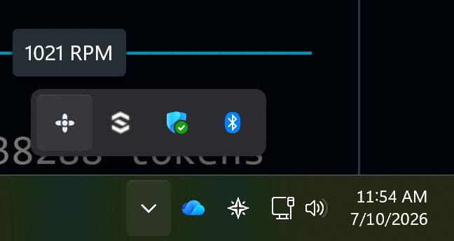
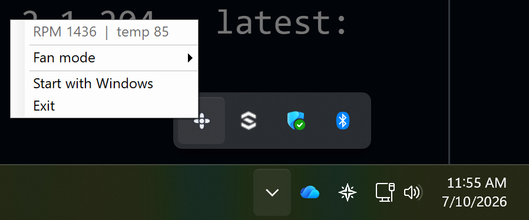

# ThinkCentre Fan Control

A lightweight, open-source system-tray fan and thermal utility for Lenovo
ThinkCentre / ThinkStation **desktops**.

These machines report fan speed as 0 through every standard interface, so
mainstream monitoring tools — and Lenovo's own software — show nothing. This
tool reads the fan tach directly from the embedded controller and puts the
**actual fan RPM** in your tray, next to one-click firmware fan modes
(quiet / balanced / performance).




## What it does

- **Live fan RPM** in the tray icon tooltip and menu, read once per second
  from the EC tach registers.
- **Temperature monitoring**: the tray shows the hottest plausible EC sensor
  (labelled exactly that — "hottest sensor" — because the sensor-to-component
  mapping is unverified; see
  [docs/research/temp-labeling.md](docs/research/temp-labeling.md)). The CLI's
  `monitor` command prints the whole raw 15-byte EC temperature block.
- **Fan mode presets**: quiet / balanced / performance via the firmware's own
  WMI interface — the same mechanism the vendor software uses, so the change
  is applied and regulated by the firmware itself.
- **Start with Windows** toggle, and a CLI (`Tcfc.Cli`) for scripted use.

## What it deliberately does not do

There is **no fine-grained RPM slider**: on these desktops the ACPI EC is
virtualized and the physical EC exposes no writable fan register (write-tested),
leaving 0–100% fan levels reachable only through an opaque ACPI method inside
runtime-loaded firmware tables — so safe fine control from Windows isn't
possible. The full reverse-engineering writeup is in
[docs/specs/2026-07-08-thinkcentre-fan-control-design.md](docs/specs/2026-07-08-thinkcentre-fan-control-design.md)
and [docs/research/ec-decode-m70t.md](docs/research/ec-decode-m70t.md).

EC access is **read-only by construction**: the EC I/O layer physically has no
RAM-write path, and fan-mode changes go through the firmware's supported WMI
call instead.

## Requirements

- Windows, running the app **as Administrator** (raw EC port I/O needs a
  kernel driver).
- The signed **[PawnIO](https://pawnio.eu/)** driver installed.
- PawnIO's EC module **`LpcACPIEC.bin`** placed next to the exe — download the
  signed `LpcACPIEC` module from the
  [PawnIO.Modules releases](https://github.com/namazso/PawnIO.Modules/releases).
  (When building from source, a repo-root `lib\pawnio\LpcACPIEC.bin` is found
  too, as is `C:\Program Files\PawnIO\modules\` if your PawnIO install ships
  modules.)

## Supported hardware

Verified on a **ThinkCentre M70t Gen 6** (baseboard product `3376`). On any
other machine the app runs **monitoring-only**: fan-mode control is gated to
the verified board, so it will show readings but refuse mode writes.
Verification reports from other ThinkCentre / ThinkStation models are very
welcome — the EC layout of each board needs to be checked before its mode
control can be enabled.

## Download & run

Grab the latest **[release zip](../../releases)**, unzip it anywhere, and run
`Tcfc.Tray.exe` **as Administrator**. The signed `LpcACPIEC.bin` module is
bundled in the zip; you still need the [PawnIO](https://pawnio.eu/) driver
installed (see Requirements above).

## Build from source

```
dotnet build
```

Then run `src\Tcfc.Tray\bin\x64\Debug\net8.0-windows\Tcfc.Tray.exe` as
Administrator (with `LpcACPIEC.bin` reachable as above). The CLI harness lives
at `src\Tcfc.Cli\...\Tcfc.Cli.exe` (`monitor`, `mode`,
`mode quiet|balanced|performance`). Tests: `dotnet test tests/Tcfc.Tests`.

## How it works / what was reverse-engineered

The stock ACPI/WMI surface on this platform is a dead end: the ACPI embedded
controller is a stub (`_STA` returns zero, every EC field reads zero) and fan
telemetry routes through firmware tables that aren't statically present. What
does work, and what this tool is built on:

- A **real physical EC** answers on ports 0x62/0x66 behind the virtualized
  ACPI layer. Reading its RAM via PawnIO's `LpcACPIEC` module and diffing
  against load/fan changes located the fan tach (16-bit big-endian at
  `0x00/0x01`, verified by tracking a full load/spin-down curve) and a
  temperature block at `0x21..0x2F`
  ([docs/research/ec-decode-m70t.md](docs/research/ec-decode-m70t.md),
  [docs/research/temp-labeling.md](docs/research/temp-labeling.md)).
- Coarse fan modes are exposed by the firmware through a WMI class in
  `root\wmi` (`GetSmartFanMode` / `SetSmartFanMode`), write-verified on the
  target board
  ([docs/research/v1-cli-verify.md](docs/research/v1-cli-verify.md)).
- Design decisions, safety gates and the full decode trail are in
  [docs/specs/2026-07-08-thinkcentre-fan-control-design.md](docs/specs/2026-07-08-thinkcentre-fan-control-design.md).

## License

MIT — see [LICENSE](LICENSE).
