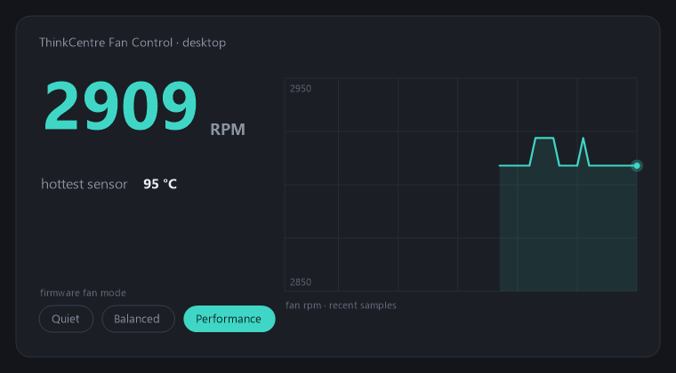

# ThinkCentre Fan Control

A lightweight, open-source system-tray fan and thermal utility for Lenovo
ThinkCentre / ThinkStation **desktops**.

These machines report fan speed as 0 through every standard interface, so
mainstream monitoring tools — and Lenovo's own software — show nothing. This
tool reads the fan tach directly from the embedded controller and puts the
**actual fan RPM** in your tray, next to one-click firmware fan modes
(quiet / balanced / performance).




## What it does

- **Live fan RPM** in the tray icon tooltip and menu, read once per second
  from the EC tach registers.
- **Temperature monitoring**: the tray shows the hottest plausible EC sensor
  (labelled exactly that — "hottest sensor" — because the sensor-to-component
  mapping is unverified; see
  [docs/research/temp-labeling.md](docs/research/temp-labeling.md)). The CLI's
  `monitor` command prints the whole raw 15-byte EC temperature block.
- **Fan mode presets**: quiet / balanced / performance via the firmware's own
  WMI interface — the same mechanism the vendor software uses, so the change
  is applied and regulated by the firmware itself.
- **Start with Windows** toggle, and a CLI (`Tcfc.Cli`) for scripted use.

## What it deliberately does not do

There is **no fine-grained RPM slider**: on these desktops the ACPI EC is
virtualized and the physical EC exposes no writable fan register (write-tested),
leaving 0–100% fan levels reachable only through an opaque ACPI method inside
runtime-loaded firmware tables — so safe fine control from Windows isn't
possible. The full reverse-engineering writeup is in
[docs/specs/2026-07-08-thinkcentre-fan-control-design.md](docs/specs/2026-07-08-thinkcentre-fan-control-design.md)
and [docs/research/ec-decode-m70t.md](docs/research/ec-decode-m70t.md).

EC access is **read-only by construction**: the EC I/O layer physically has no
RAM-write path, and fan-mode changes go through the firmware's supported WMI
call instead.

## Installation

**Before you start, you need:**
- A **Windows 10 / 11** desktop — ideally a **Lenovo ThinkCentre M70t Gen 6**, the verified model (other ThinkCentre / ThinkStation desktops: see [Supported hardware](#supported-hardware)).
- **Administrator** rights on the machine.

### Step 1 — Install the PawnIO driver

The app reads the embedded controller directly, which needs a ring-0 driver. It uses **[PawnIO](https://pawnio.eu/)** — a small, **code-signed** driver (the same one [FanControl](https://github.com/Rem0o/FanControl.Releases) and LibreHardwareMonitor use), *not* the old antivirus-flagged WinRing0.

1. Download the installer from **[pawnio.eu](https://pawnio.eu/)**.
2. Run it and click through — accept the UAC prompt (it installs a signed kernel driver and a background service).

### Step 2 — Download ThinkCentre Fan Control

1. Grab the latest **[release ZIP](../../releases/latest)**.
2. Unzip it anywhere (e.g. `C:\Tools\ThinkCentreFanControl`). The signed `LpcACPIEC.bin` EC module is **already bundled in the ZIP** — nothing else to download. Keep the files together; don't move `Tcfc.Tray.exe` out on its own or it won't find the module.

### Step 3 — Run it

Right-click **`Tcfc.Tray.exe`** → **Run as administrator**. (A normal double-click also works — it requests elevation and shows a UAC prompt.)

> **First-run SmartScreen note:** the release exe isn't code-signed, so Windows may pop *"Windows protected your PC."* Click **More info → Run anyway**. It's fully open source — read every line here, or [build it yourself](#build-from-source).

A small **fan icon** appears in your system tray (it may be tucked under the **`^`** "show hidden icons" arrow). That's it — you're running.

## Usage

- **Hover** the tray icon → the tooltip shows your live **fan RPM**.
- **Right-click** the icon for the menu:
  - **Header line:** `RPM <n>  |  hottest sensor <n> °C`, refreshing every second. ("Hottest sensor" is deliberately vague — see [What it does](#what-it-does).)
  - **Fan mode → Quiet / Balanced / Performance** — click one to switch; a ✓ marks the active mode. *(Enabled only on the verified board — see [Supported hardware](#supported-hardware).)*
  - **Start with Windows** — launches it at logon (as an elevated scheduled task, so no UAC prompt each boot).
  - **Exit.**

**What the fan modes do:** they select the firmware's own thermal profile — the exact control Lenovo Vantage exposes — so the fan curve stays applied and regulated by the firmware. *Quiet* keeps it calmer, *Performance* lets it ramp sooner. They are presets, **not** a manual RPM slider (see [What it deliberately does not do](#what-it-deliberately-does-not-do)).

## Supported hardware

Everything is **verified on a ThinkCentre M70t Gen 6** (baseboard product `3376`).

- **On the M70t Gen 6:** RPM and temperature readings are correct, and fan-mode control is enabled.
- **On other ThinkCentre / ThinkStation desktops:** fan-mode control is **disabled by design** — the app refuses to write firmware modes on an unverified board (the menu shows *"monitoring only"*). And because the readings use the M70t's EC register layout, on a different board **the RPM/temperature numbers may be wrong or meaningless** — don't trust them until that board is verified.

Want it working on your model? The EC layout (which registers hold the tach and temperatures) has to be checked per board — [open an issue](../../issues) with your model name and baseboard product and we can figure it out.

## Uninstall

Tray → **Exit** (untick **Start with Windows** first if you enabled it), then delete the unzipped folder. To remove the driver as well, uninstall **PawnIO** from *Settings → Apps → Installed apps*.

## Troubleshooting

| Symptom | Fix |
|---|---|
| **"EC not available"** on launch | You're not running as **Administrator**, **PawnIO isn't installed**, or `LpcACPIEC.bin` isn't beside the exe (it ships in the ZIP — keep the files together). |
| Tray shows **`- RPM`** | A read timed out — usually another EC/fan/monitoring tool is holding the EC lock (close it), or you're not elevated. |
| **Fan mode items greyed out** / "monitoring only" | Your board isn't the verified `3376`; control is gated for safety (see [Supported hardware](#supported-hardware)). |
| **"Windows protected your PC"** | Unsigned exe → **More info → Run anyway**, or build from source. |

## Build from source

Requires the [.NET 8 SDK](https://dotnet.microsoft.com/download/dotnet/8.0).

```
dotnet build
dotnet test tests/Tcfc.Tests
```

Run `src\Tcfc.Tray\bin\x64\Debug\net8.0-windows\Tcfc.Tray.exe` as Administrator. When building, the module is found next to the exe, at the repo's `lib\pawnio\LpcACPIEC.bin`, or at `C:\Program Files\PawnIO\modules\` — grab the signed `LpcACPIEC` module from the [PawnIO.Modules releases](https://github.com/namazso/PawnIO.Modules/releases) if you don't already have it.

A console harness for scripting/power use is built alongside the tray (not shipped in the release ZIP): `src\Tcfc.Cli\bin\x64\Debug\net8.0-windows\Tcfc.Cli.exe`, run from an elevated terminal:

```
Tcfc.Cli monitor                            # live RPM + the full 15-byte EC temp block + mode, until a key
Tcfc.Cli mode                               # show current and supported modes
Tcfc.Cli mode quiet|balanced|performance    # set a mode (verified board only)
```

## How it works / what was reverse-engineered

The stock ACPI/WMI surface on this platform is a dead end: the ACPI embedded
controller is a stub (`_STA` returns zero, every EC field reads zero) and fan
telemetry routes through firmware tables that aren't statically present. What
does work, and what this tool is built on:

- A **real physical EC** answers on ports 0x62/0x66 behind the virtualized
  ACPI layer. Reading its RAM via PawnIO's `LpcACPIEC` module and diffing
  against load/fan changes located the fan tach (16-bit big-endian at
  `0x00/0x01`, verified by tracking a full load/spin-down curve) and a
  temperature block at `0x21..0x2F`
  ([docs/research/ec-decode-m70t.md](docs/research/ec-decode-m70t.md),
  [docs/research/temp-labeling.md](docs/research/temp-labeling.md)).
- Coarse fan modes are exposed by the firmware through a WMI class in
  `root\wmi` (`GetSmartFanMode` / `SetSmartFanMode`), write-verified on the
  target board
  ([docs/research/v1-cli-verify.md](docs/research/v1-cli-verify.md)).
- Design decisions, safety gates and the full decode trail are in
  [docs/specs/2026-07-08-thinkcentre-fan-control-design.md](docs/specs/2026-07-08-thinkcentre-fan-control-design.md).

## License

MIT — see [LICENSE](LICENSE).
